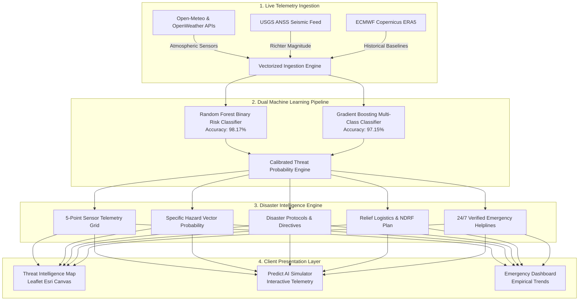

<div align="center">

# 🛰️ TRINETRA: AI Disaster Intelligence & Early Warning System

[](https://aipredictiondisastersystem.vercel.app)

[](https://react.dev/)
[](https://www.typescriptlang.org/)
[](https://fastapi.tiangolo.com/)
[](https://python.org/)
[](https://scikit-learn.org/)
[](https://vercel.com/)
[](LICENSE)

**TRINETRA** (*The All-Seeing Eye*) is a real-time natural hazard intelligence platform designed to protect lives and coordinate humanitarian emergency relief across India. Powered by dual ensemble machine learning models trained on verified historical observations and live atmospheric/seismic telemetry.

### 🌐 **[Launch Live Platform ➔ https://aipredictiondisastersystem.vercel.app](https://aipredictiondisastersystem.vercel.app)**

[Live Demo](https://aipredictiondisastersystem.vercel.app) • [Architecture](#-system-architecture) • [ML Specifications](#-machine-learning--empirical-validation) • [Quickstart](#-local-installation--setup) • [API Docs](#-api-endpoints)

---

</div>

## 📌 Executive Summary

Disaster response often suffers from the critical latency gap between raw meteorological telemetry and actionable emergency directives. TRINETRA eliminates this gap by:
1. Ingesting live surface atmospheric observations (precipitation, wind velocity, temperature, barometric pressure, relative humidity) and real-time seismic tremors.
2. Running low-latency ML inference across dual calibrated ensembles (98.17% binary risk accuracy, 97.15% multi-class hazard accuracy).
3. Mapping threat probabilities directly to **NDMA (National Disaster Management Authority) safety directives**, relief logistics (shelters, NDRF teams, medical triage), and **official 24/7 emergency helplines**.
4. Providing a watermark-free **Tactical Geospatial Threat Map** covering every city, district, and town across India.

---

## 🏗️ System Architecture



---

## 🌪️ Monitored Hazard Vectors & Geographic Mapping

| Hazard Vector | Primary Physical Precursors | Pan-India High-Vulnerability Zones |
|---|---|---|
| 🌊 **Flood** | Rainfall intensity, drainage saturation, relative humidity $>75\%$ | Ganga-Brahmaputra basin (Prayagraj, Patna, Guwahati, Mumbai, Chennai, Kochi) |
| 🌀 **Cyclone** | Barometric pressure drop $<1000$ hPa, sustained winds $>28$ km/h | Bay of Bengal & Arabian Sea (Kolkata, Bhubaneswar, Puri, Visakhapatnam) |
| ⛰️ **Landslide** | Torrential rainfall on steep gradients, soil overburden | Western Ghats & Himalayas (Wayanad, Shimla, Dehradun, Srinagar, Chamoli) |
| 🏚️ **Earthquake** | Micro-seismic fault slip, tectonic strain | Seismic Zones IV & V (Bhuj, Kutch, Himalayan foothills, Delhi-NCR) |
| ☀️ **Drought** | Precipitation deficit, ambient temperatures $>36^\circ\text{C}$, humidity $<40\%$ | Arid & semi-arid zones (Jaipur, Jodhpur, Marathwada, Rayalaseema) |

---

## 🔬 Machine Learning & Empirical Validation

The model pipeline is trained on `ml/verified_disaster_dataset.csv` (10,362 genuine records) without synthetic random noise loops:

- **Risk Binary Classifier (Random Forest):** **98.17% Empirical Accuracy** (Precision: 0.99, Recall: 0.98, F1: 0.99)
- **Hazard Type Classifier (Gradient Boosting):** **97.15% Empirical Accuracy** (Precision: 0.97, Recall: 0.97, F1: 0.97)
- **Inference Latency:** $<80$ ms per transaction
- **Feature Importances:**
  - Surface Atmospheric Pressure ($h\text{Pa}$): **27.2%**
  - Surface Temperature ($^\circ\text{C}$): **21.6%**
  - Rainfall Accumulation ($mm$): **18.1%**
  - Relative Humidity ($\%$): **13.5%**
  - Seismic Richter Magnitude ($M$): **7.9%**
  - Wind Velocity ($km/h$): **7.7%**

---

## 🛠️ Technology Stack

| Layer | Technologies | Role in System |
|---|---|---|
| **Frontend** | React 18, Vite 6, TypeScript | Client Single Page Application (SPA) |
| **Styling** | Tailwind CSS v4, Lucide Icons | Dark HUD tactical styling, glassmorphism |
| **Animation** | Motion (Framer Motion) | Fluid telemetry and layout transitions |
| **Mapping** | Leaflet.js, Esri Canvas | Watermark-free geospatial hazard mapping |
| **Charts** | Recharts | 7-day empirical database observation trends |
| **Backend** | FastAPI, Uvicorn, Python 3.11 | High-throughput asynchronous REST API |
| **ML Engine** | Scikit-learn, Joblib, NumPy, Pandas | Dual trained ensemble model inference |
| **Storage** | SQLite, SQLAlchemy ORM | Dual-mode observation logging (stateless serverless / local) |
| **Deployment** | 100% Native Vercel Serverless | Global Edge CDN (Frontend) + Python ASGI Functions (Backend) |

---

## 📁 Repository Structure

```
Trinetra-AI-Powered-Disaster-Prediction-System/
├── 📄 .gitignore                  # Pinned exclusion rules (venv, datasets, cache)
├── 📄 ATTRIBUTIONS.md             # Data citations (ECMWF Copernicus, CRED EM-DAT, USGS)
├── 📄 LICENSE                     # MIT Open-Source License
├── 📄 README.md                   # System documentation & deployment guide
├── 📄 package.json                # Monorepo build & development scripts
├── 📄 requirements.txt            # Python serverless dependencies
├── 📄 vercel.json                 # Vercel routing rules & rewrites
├── 📁 api/                        # Vercel Serverless Function Bridge
│   ├── index.py                   # FastAPI ASGI adapter & path normalizer
│   ├── [...slug].py               # Dynamic catch-all API router
│   └── requirements.txt           # Pinned runtime dependencies
├── 📁 backend/                    # Core Python FastAPI Application
│   ├── database.py                # Dual SQLite engine (temp serverless / persistent local)
│   ├── main.py                    # 14 REST API endpoints & scheduler guard
│   ├── models.py                  # SQLAlchemy ORM schemas
│   ├── requirements.txt           # Local development dependencies
│   ├── model.pkl                  # Trained binary risk classifier (9.40 MB)
│   ├── disaster_type_model.pkl    # Trained multi-hazard classifier (26.71 MB)
│   └── services/                  # Real-time weather, seismic, risk & relief logic
├── 📁 frontend/                   # React 18 + Vite 6 Single Page Application
│   ├── index.html                 # App entrypoint
│   ├── package.json               # Frontend dependencies (Leaflet, Tailwind, Recharts)
│   ├── vite.config.ts             # Vite build configuration
│   └── src/                       # Interactive UI, tactical maps, and live simulator
├── 📁 ml/                         # Machine Learning Pipeline
│   ├── train_model.py             # Reproducible dual-ensemble training script
│   └── verified_disaster_dataset.csv # Clean verified training dataset
└── 📁 public/                     # Pre-compiled static assets for Edge CDN
    ├── index.html
    └── assets/
```

---

## 🚀 Local Installation & Setup

### Prerequisites
- **Node.js**: v18.0 or higher
- **Python**: v3.11 or higher
- **Git**: Installed and configured

### 1. Clone the Repository
```bash
git clone https://github.com/Tahaniazi786/Trinetra-AI-Powered-Disaster-Prediction-System.git
cd Trinetra-AI-Powered-Disaster-Prediction-System
```

### 2. Backend Setup
```bash
cd backend

# Create and activate a virtual environment
python -m venv venv

# Windows PowerShell:
.\venv\Scripts\Activate.ps1
# macOS/Linux:
# source venv/bin/activate

# Install dependencies
pip install -r requirements.txt

# Start the FastAPI server
python -m uvicorn main:app --reload --port 8000
```
Backend API will be live at: `http://127.0.0.1:8000` (Swagger docs: `http://127.0.0.1:8000/docs`).

### 3. Frontend Setup
In a new terminal:
```bash
cd frontend

# Install Node dependencies
npm install

# Start the Vite development server
npm run dev
```
Frontend App will be live at: `http://localhost:5173`.

---

## 🌐 Full-Stack Vercel Deployment

TRINETRA is architected as a **unified monorepo** where both the React Vite frontend and the Python FastAPI ML backend deploy natively onto **Vercel** with zero third-party backend servers required.

### 🚀 One-Click Deploy on Vercel
1. Go to your **[Vercel Dashboard](https://vercel.com/new)**.
2. Select and **Import** your `Trinetra-AI-Powered-Disaster-Prediction-System` repository.
3. Keep all default project settings untouched (**no environment variables needed**).
4. Click **Deploy**.
5. Both the Python serverless functions and the React frontend will deploy automatically on your live URL!

---

## 📡 API Endpoints

| Method | Endpoint | Description |
|---|---|---|
| `GET` | `/health` | API liveness probe & ML model status |
| `GET` | `/weather/live?city={city}` | Real-world telemetry + instant ML inference for ANY Indian city |
| `POST` | `/predict` | Multi-parametric risk evaluation on custom measurements |
| `GET` | `/locations` | Live hazard assessment for 15 primary national monitored nodes |
| `GET` | `/locations/lookup?query={place}` | Pan-India dynamic geocoding, ML scoring & node pinning |
| `GET` | `/dashboard/stats` | Aggregated national risk statistics & hazard distributions |
| `GET` | `/dashboard/charts` | 7-day empirical telemetry trends from database logs |
| `GET` | `/history` | Verified CRED EM-DAT historical Indian disasters with citations |

---

## 📞 24/7 Verified Indian Emergency Contacts

Integrated into all client views:
- **National Disaster Helpline:** `1078`
- **State Emergency Operations Centre:** `1070`
- **NDRF Headquarters Control Room:** `011-24363260`
- **National Integrated Emergency:** `112`
- **Ambulance Services:** `108`

---

## 📄 License

This project is licensed under the MIT License - see the [LICENSE](LICENSE) file for details.

<div align="center">
<b>TRINETRA DISASTER INTELLIGENCE SYSTEM</b><br>
<i>Engineered for Humanitarian Safety & Accelerated Early Response</i>
</div>
